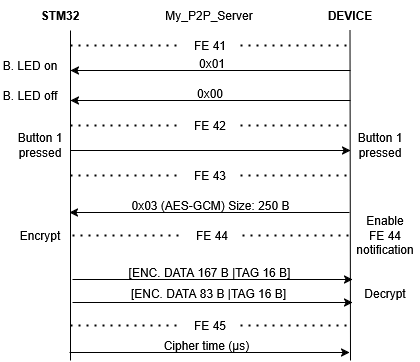

# BLE STM32WB Application

An elegant, modular C application for the STM32WB55 MCU that functions as a BLE peripheral device (GATT Server) with its **own P2P service**. The application performs encryption using ChaCha20, ChaCha20-Poly1305, or AES-GCM and sends data back via notifications.

Pairing application for the BleScanner application: https://github.com/xvlach/BleScanner.git

---

## 🚀 Project Overview

This STM32WB application:

1. **Advertises** a BLE P2P Server (Service UUID FE40).
2. **Accepts** connections from the PC application (BleScanner).
3. **Initializes** the encryption context (ChaCha20 / ChaCha20-Poly1305 / AES-GCM).
4. **Waits** for a write to the **DATA\_IN** characteristic (FE43).
5. **Processes** the received packet, performs any logic (e.g., lights an LED, processes data, and prepares it for transmission).
6. **Encrypts** the response and sends it as a **notification** on **DATA\_OUT** (FE44).
7. **Logs** timestamps and debug outputs via UART (Serial) and sends encryption timing data via **DATA\_OUT\_TIME**.

---

## 📂 Project Structure

```
BleSTM32WB/
├── BLE.ioc                           ← CubeMX project
├── Core/
│   ├── Inc/                          ← Main header files (main.h, stm32wbxx_hal_conf.h…)
│   └── Src/                          ← main.c, system configuration (clock, GPIO, DMA, UART…)
├── CustomFiles/
│   ├── Inc/
│   │   └── encrypt.h                 ← ECDH + ChaCha/AES function interface (mbedTLS wrapper)
│   └── Src/
│       └── encrypt.c                 ← Cryptography implementation
├── STM32_WPAN/
│   └── App/                          ← GATT server layer
│       ├── custom_app.h/.c           ← P2P service initialization and characteristic logic
│       ├── custom_stm.h/.c           ← Handle definitions and characteristic update logic
│       └── template_server_app.h     ← ST’s P2P server template
├── Drivers/                          ← HAL and BSP drivers
├── Middlewares/Third_Party/mbedtls/  ← mbedTLS 3.x library
├── Utilities/                        ← LPM (low-power), Sequencer
├── STM32WB55RGVX_FLASH.ld            ← Linker script for Flash
└── STM32WB55RGVX_RAM.ld              ← Linker script for RAM
```

---

## 🔧 Dependencies

- **STM32CubeWB** (BLE stack + HAL)
- **mbedTLS 3.x** (included in Middlewares/Third\_Party)
- **STM32CubeIDE ≥ v1.14** (or other tools compatible with `.ioc`)
- **GCC / ARM Compiler** (depending on project configuration)

---

## 🛠️ Build & Flash

1. **Open** the `BLE.ioc` file in STM32CubeIDE.
2. **Generate** code (Project → Generate Code).
3. **Build** the project (`Build → Build Project`).
4. **Flash** to the MCU (`Run → Debug` or via ST-Link).

---

## 🎮 Usage

1. **Launch** the BleScanner PC application.
2. **Select** the correct interface and start scanning; the **P2P\_Server** (MAC address) will appear.
3. **Connect** and choose an algorithm (ChaCha20 / ChaCha20-Poly1305 / AES-GCM).
4. **Send** requests – the MCU decrypts and processes them (e.g., toggles LEDs, reads inputs).
5. The **MCU** sends the encrypted response as a BLE notification, and the PC application decrypts and displays it in the GUI.
6. **UART** debug outputs can be monitored at 115200 bps.

---

## 🧩 How It Works

- **main.c**
  - Initializes HAL, Sequencer, BLE stack, UART, and cryptography.
  - Runs `MX_APPE_Init()` and enters the main loop (`APP_Run()`).
- **custom\_app.c / custom\_stm.c**
  - Defines the P2P service (UUID FE40) and five characteristics:
    - `LED_Char` (FE41)
    - `Switch_Char` (FE42)
    - `DATA_IN_Char` (FE43) – write from PC
    - `DATA_OUT_Char` (FE44) – notifications of responses
    - `DATA_OUT_TIME_Char` (FE45) – notifications of timing data
  - Implements callbacks for writes and notifications.
- **encrypt.c**
  - Initializes mbedTLS context (ChaCha20 / ChaCha20-Poly1305 / AES-GCM).
  - Provides `encrypt_data()` / `decrypt_data()` with runtime measurement (uwTick).
- **Utilities**
  - **Sequencer** for task scheduling.
  - **LPM** (low-power manager) for power-saving between operations.

---

## 🖼️ GATT Structure
<p align="center">

</p>

---

## ✍️ Extending the Project

Prefer using STM32CubeMX for all configurations.

- **New GATT Services**:

  1. Add the characteristic and configure it under "STM32\_WPAN -> BLE -> My\_P2P\_Server".
  2. Generate code.
  3. Update the write/notification handlers in `custom_app.c` / `custom_stm.c`.

- **Additional Encryption**:

  1. Add your algorithm to `encrypt.c`.

- **Porting**:

  - Can be ported to other STM32s with the WPAN stack.

---

## 📝 Contact

If you need assistance, feel free to reach out: [xvlach23@vutbr.cz](mailto\:xvlach23@vutbr.cz)

---

# BLE STM32WB aplikace

Elegantní, modulární C aplikace pro STM32WB55MCU, která funguje jako BLE periferní zařízení (GATT Server) se **vlastní P2P službou**. Aplikace provádí šifrování pomocí ChaCha20, ChaCha20-Poly1305 nebo AES-GCM a posílá data zpět přes notifikace.

Párová aplikace k aplikaci k BleScanner: https://github.com/xvlach/BleScanner.git

---

## 🚀 Přehled projektu

Tato aplikace na STM32WB provádí:

1. **Advertises** BLE P2P Server (Service UUID FE40).
2. **Accepts** spojení z PC aplikace (BleScanner).
3. **Inicializuje** šifrovací kontext (ChaCha20 / ChaCha20-Poly1305 / AES-GCM).
4. **Čeká** na zápis na charakteristiku **DATA\_IN** (FE43).
5. **Zpracuje** přijatý paket, vykoná případnou logiku (např. rozsvítí LED, zpracovává data a připravuje je k odeslání).
6. **Zašifruje** odpověď a pošle ji jako **notifikaci** na **DATA\_OUT** (FE44).
7. **Zaznamenává** časové značky a debug výstupy přes UART (Serial) a odesílá časové údaje o šifrování přes **DATA\_OUT\_TIME**.

---

## 📂 Struktura projektu

```
BleSTM32WB/
├── BLE.ioc                           ← CubeMX projekt
├── Core/
│   ├── Inc/                          ← Hlavní hlavičkové soubory (main.h, stm32wbxx_hal_conf.h…)
│   └── Src/                          ← main.c, systémová konfigurace (clock, GPIO, DMA, UART…)
├── CustomFiles/
│   ├── Inc/
│   │   └── encrypt.h                 ← Rozhraní ECDH + ChaCha/AES funkcí (mbedTLS wrapper)
│   └── Src/
│       └── encrypt.c                 ← Implementace klíčové kryptografie
├── STM32_WPAN/
│   └── App/                          ← GATT server vrstvy
│       ├── custom_app.h/.c           ← Inicializace P2P služby a charakteristik
│       ├── custom_stm.h/.c           ← Definice handle a logika aktualizace charakteristik
\
│       └── template_server_app.h     ← Šablona P2P serveru od ST
├── Drivers/                          ← HAL a BSP ovladače
├── Middlewares/Third_Party/mbedtls/  ← mbedTLS 3.x knihovna
├── Utilities/                        ← LPM (low-power), Sequencer
├── STM32WB55RGVX_FLASH.ld            ← Linker script pro Flash
└── STM32WB55RGVX_RAM.ld              ← Linker script pro RAM
```

---

## 🔧 Závislosti

- **STM32CubeWB** (BLE stack + HAL)
- **mbedTLS 3.x** (který je již součástí Middlewares/Third\_Party)
- **STM32CubeIDE ≥ v1.14** (nebo jiné nástroje kompatibilní s `.ioc`)
- **GCC / ARM Compiler** (podle konfigurace projektu)

---

## 🛠️ Build & Flash

1. **Otevři** soubor `BLE.ioc` v STM32CubeIDE.
2. **Generuj** kód (Project → Generate Code).
3. **Build** projekt (`Build → Build Project`).
4. **Flash** do MCU (`Run → Debug` nebo přes ST-Link).

---

## 🎮 Použití

1. **Spusť** PC aplikaci BleScanner.
2. **Vyber** v ní správné rozhraní a spusť skenování; zobrazí se **P2P\_Server** (MAC adresa).
3. **Připoj** se a zvol algoritmus (ChaCha20 / ChaCha20-Poly1305 / AES-GCM).
4. **Odesílej** požadavky – MCU je dešifruje a zpracuje (např. přepne LED, odečte vstupy).
5. **MCU** zašle zašifrovanou odpověď formou BLE notifikace, PC aplikace ji dešifruje a vykreslí v GUI.
6. **UART** debug výstupy lze sledovat v terminálu na 115200 bps.

---

## 🧩 Jak to funguje

- **main.c**
  - Inicializace HAL, sekvence, BLE stacku, UART a kryptografie.
  - Spuštění `MX_APPE_Init()` a hlavní smyčka (`APP_Run()`).
- **custom\_app.c / custom\_stm.c**
  - Definice P2P služby (UUID FE40) a pět charakteristik:
    - `LED_Char` (FE41)
    - `Switch_Char` (FE42)
    - `DATA_IN_Char` (FE43) – zápis od PC
    - `DATA_OUT_Char` (FE44) – notifikace odpovědí
    - `DATA_OUT_TIME_Char` (FE45) – notifikace časových údajů
  - Callbacky pro zápis a notifikace.
- **encrypt.c**
  - Inicializace mbedTLS kontextu (ChaCha20 / ChaCha20-Poly1305 / AES-GCM).
  - Implementace `encrypt_data()` / `decrypt_data()` s měřením běhu (uwTick).
- **Utilities**
  - **Sequencer** pro plánování úloh.
  - **LPM** (low-power manager) pro úsporný režim mezi operacemi.

---

## 🖼️ Struktura GAT
<p align="center">

</p>

---

## ✍️ Rozšiřování

Ideální je využívat STM32CubeMX pro veškeré konfigurace.

- **Nové GATT služby**:

  1. Přidání charakteristiky a její konfigurace v "STM32\_WPAN -> BLE -> My\_P2P\_Server".
  2. Generování kódu.
  3. Úprava handlerů zápisu/notifikací v `custom_app.c` / `custom_stm.c`.

- **Dodatečné šifrování**:

  1. Přidej svůj algoritmus do `encrypt.c`.

- **Portování**:

  - Lze portovat na jiné STM32 s WPAN stackem.

---

## 📝 Kontakt

Potřebuješ s něčím pomoc, můžeš mi napsat na: [xvlach23@vutbr.cz](mailto\:xvlach23@vutbr.cz)

